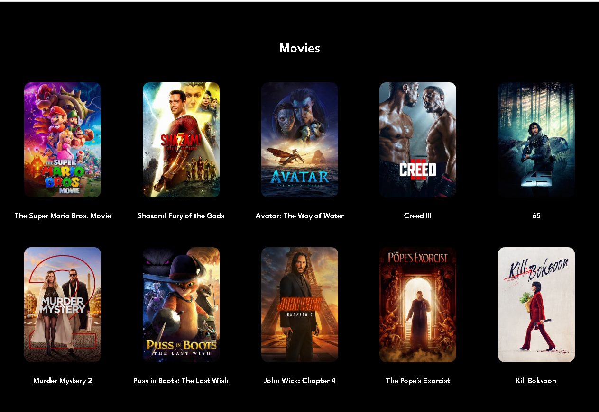
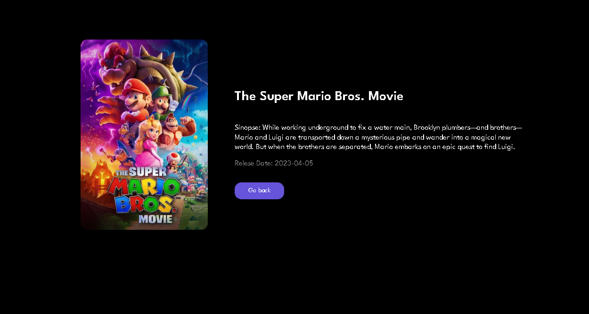

<h1>API FILMES REACT</h1>
 
<h2>Projeto criado em React que faz o consumo de uma api do The Movie Database API<h2>

 Para rodar o projeto você precisa fazer os seguintes passos:  
1°: Precisa ter o NodeJs installado acessando este link: https://nodejs.org/en você installar a versão LTS.  
2°: Precisa ter o Git installado acessando este link: https://git-scm.com/  
3°: Basta abrir o terminal e executar o comando git clone git@github.com:renanbaratella/api-filmes-react.git  
4°: cd api-filmes-react  
5°: Executar o comando npm install  
6°: npm start  
# Acesse seu localhost porta 3000  
http://localhost:3000/ 

